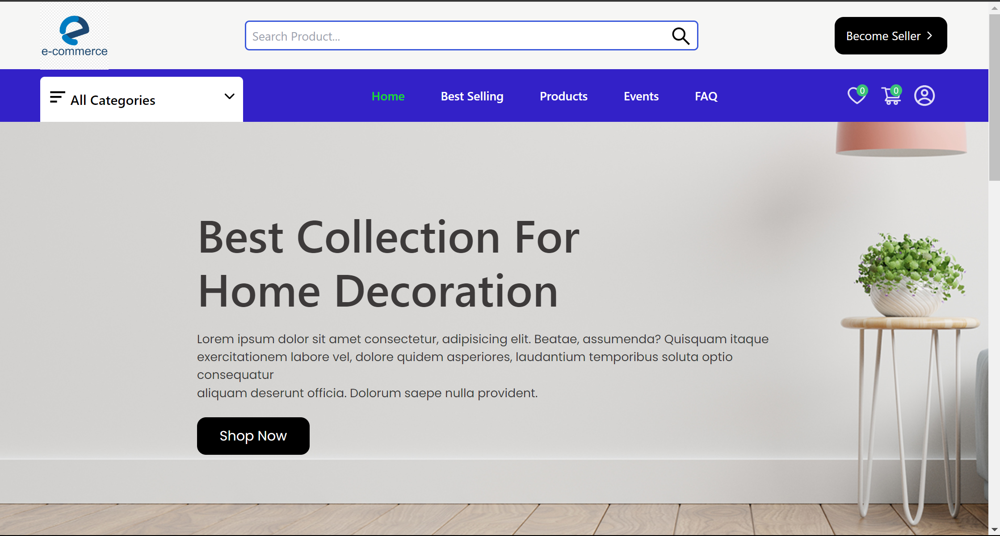

# Dynamic E-Commerce

Multivendor MERN-Stack is an ecommerce web application

## Tools and Packages

&nbsp;
&nbsp;
&nbsp;
&nbsp;
&nbsp;
&nbsp;
&nbsp;
&nbsp;

&nbsp;

## Features

-   Login/Signup User Account
-   Update Profile/Password User Account
-   Reset Password Mail using nodemailer
-   Cart Add/Remove Items | Update Quantities
-   Wishlist Add/Remove Items
-   Products Pagination (Default 8 Products Per Page)
-   Product Search
-   Product Filters Based on Category/Ratings/Price
-   Make Payment using Stripe
-   My Orders (With All Filters)
-   Order Details of All Ordered Item
-   Review Products User Account
-   Register as a seller and list your products
-   Admin: Dashboard access to only admin roles
-   Admin: Update Order Status | Delete Order
-   Admin: Add/Update Products
-   Admin: Update User Data | Delete User
-   Admin: List Review of Product | Delete Review
-   Stock Management: Decrease stock of product when shipped

## Run Locally

Clone the project

```bash
  git clone https://github.com/TAbishek22/Dynamic-Ecommerce.git
```

Go to the project directory

```bash
  cd project
```

Install dependencies

```bash
  cd backend
  npm install
```

```bash
  cd frontend/
  yarn
```

```bash
  cd socket/
  npm install
```

## Environment configurations

set your config.env file : use given format

```
PORT=8000
DB_URI='mongodb_uri'
JWT_SECRET='your jwt secret'
JWT_EXPIRE= 1d
COOKIE_EXPIRE = 7
SMPT_SERVICE=gmail
SMPT_MAIL='your email'
SMPT_PASSWORD='email password'
SMPT_HOST=smtp.gmail.com
SMPT_PORT=587
STRIPE_API_KEY='stripe key'
STRIPE_SECRET_KEY='stripe secret'
```

## Deploying Locally

Start the server

```bash
  cd socket
  npm start
```

```bash
  cd backend
  npm run dev
```

Start the frontend

```bash
  cd frontend
  npm start
```

## UI Screenshot

-   Home UI
    
